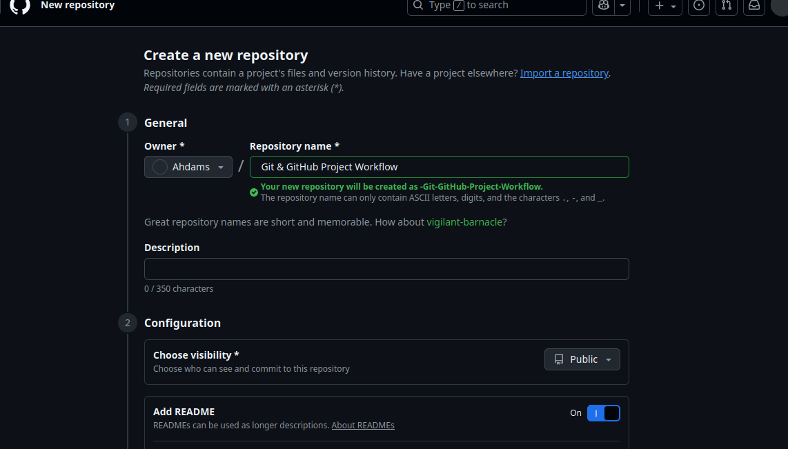
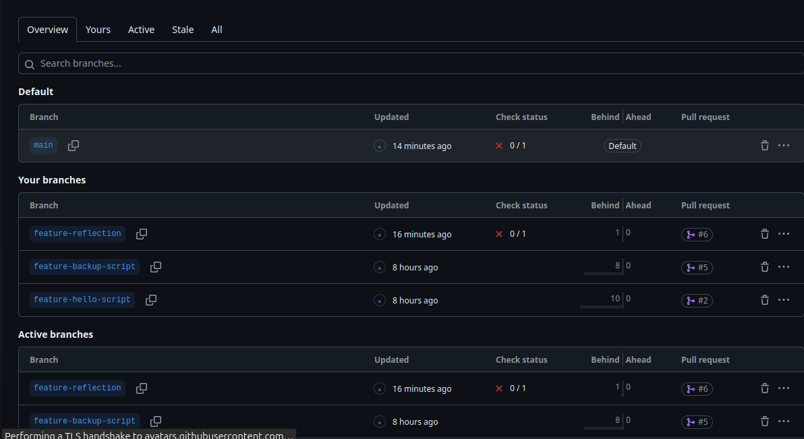
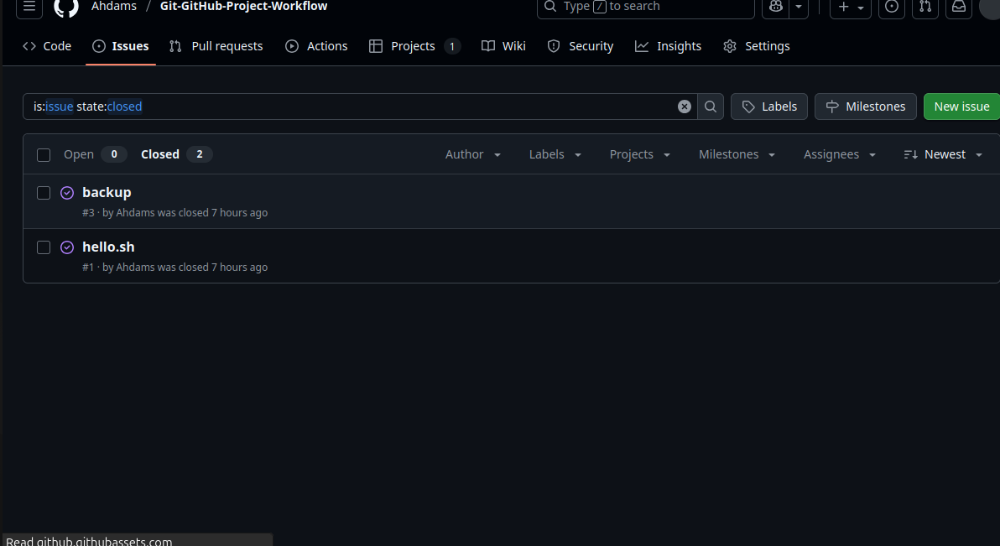
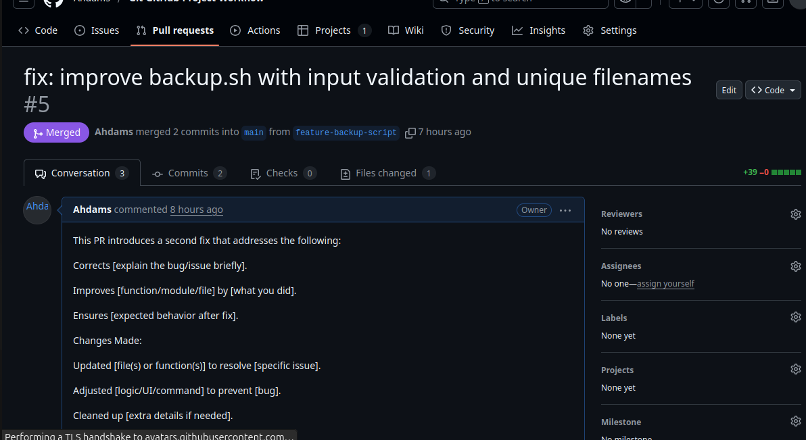
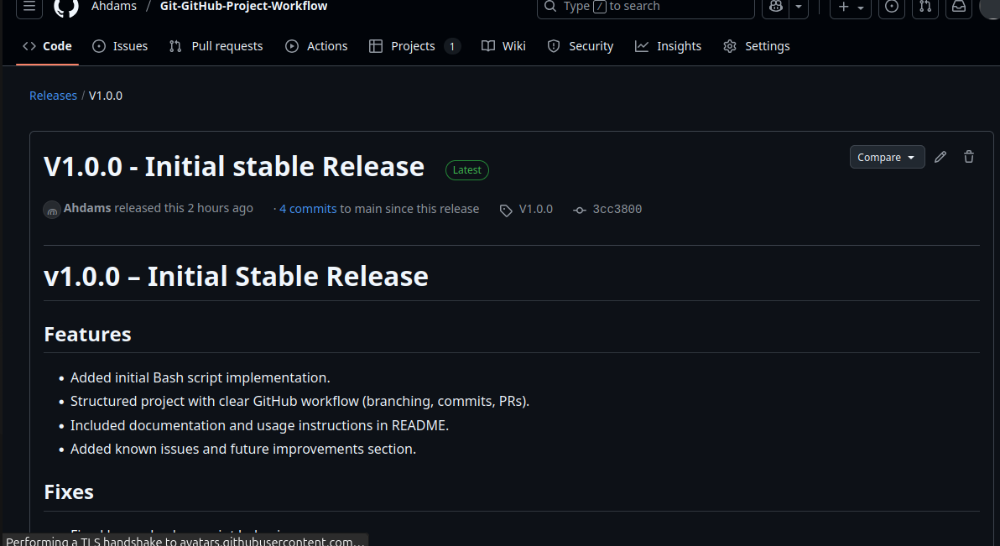
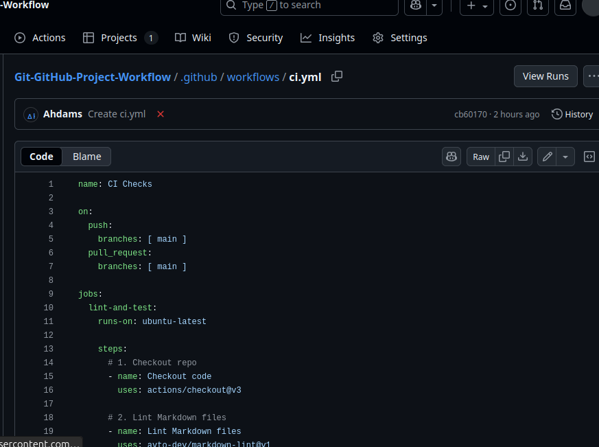
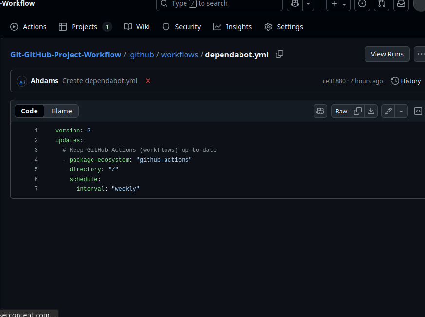

# **Reflection on Git & GitHub Project Workflow**

## **Working on this project has given me hands-on experience with Git and GitHub, moving beyond simple commits and into a structured workflow that resembles real-world software development practices. I’ll summarize the key lessons and reflections from each stage:**

## **1\. Repository Setup**

Creating a repository with a **README, .gitignore, and license** taught me the importance of setting a strong foundation. A clear README communicates the project’s purpose to collaborators and users. The .gitignore file avoids clutter by excluding unnecessary files, and choosing a license defines how others can use my work.                                                                          **Key lesson:** Good projects start with proper structure and documentation, not just code.. 

**Screenshot of my repository setup:**

## **2\. Branching Strategy**

Using feature branches instead of working directly on main helped me understand the principle of keeping the **main branch stable**. Each new change had its own branch, and commits were made with **clear, descriptive messages**.

**Key lesson:** Branches isolate work, making collaboration safer and history cleaner.

**Screenshot of branches:**

## 

## 

## **3\. Issues and Project Management**

Opening issues for new features, bugs, and documentation updates showed me how GitHub can be used as a **task management tool**, not just for code. Linking issues to branches and closing them via PRs reinforced accountability. Using the **GitHub Projects board** (To Do → In Progress → Done) gave me visibility into progress.

**Key lesson:** Issues and project boards turn a code repository into a real project management space.

**Screenshot of issues:**

## 

## 

## **4\. Pull Requests and Code Reviews**

Even though this was a solo project, I simulated code reviews by leaving comments on my own PRs. This practice helped me spot improvements I might have missed. Writing meaningful PR titles and descriptions also reminded me that good communication is as important as good code.

**Key lesson:** Pull requests create a review culture where code is never merged blindly.

**Screenshot of pull request:**

## 

## 

## **5\. Release Management**

Creating a **v1.0.0 release with release notes** taught me the importance of versioning. Tagging commits ensures that a specific snapshot of the project can always be referenced.

**Key lesson:** Releases make software feel professional and maintainable.

**Screenshot of release page:**

## 

## 

## **6\. Advanced Workflow (GitHub Actions & Dependabot)**

Setting up a **CI pipeline** with linting and shell script checks showed me how automation enforces quality. Dependabot introduced me to **automated dependency management**, which reduces technical debt.

**Key lesson:** Automation and  make projects scalable and reliable.

**Screenshot of GitHub Actions workflow:**  

**Screenshot of Dependabot PR:**  

## 

## 

## **Final Reflection**

Through this workflow, I’ve moved from seeing GitHub as just a “code storage site” to understanding it as a **full collaboration platform**. Every stage—branches, issues, PRs, reviews, releases, CI/CD—mirrors real-world software team practices.

If I were working in a team, these practices would ensure clarity, accountability, and efficiency. Even as an individual, these habits make me more organized, and future-ready.

**Overall takeaway:**  
 Version control is not just about saving code. It is about **managing changes, collaborating effectively, and building software that can grow sustainably.**

## **Email**

- sangdaviddorcas@gmail.com
- okekekenechukwu281@gmail.com
